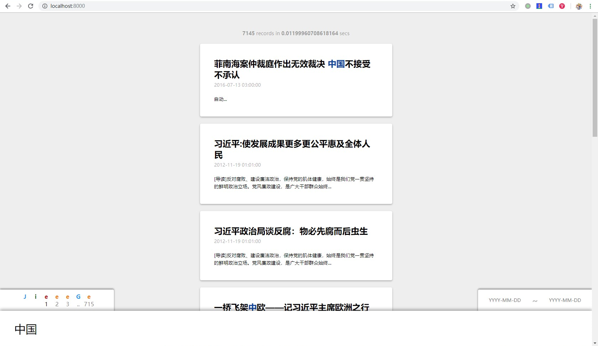

# PaperCan

**PaperCan** a.k.a. 杰哥Search 是一个爬取、搜索、展示新闻的网站，名称来源是废纸篓。

# 功能简介

## 脚本
项目根目录下的以下脚本可以直接执行：

- seeder.py 根据 config.yml 初始化 crawler 的工作队列
- crawler.py 从工作队列中的URI爬取网站，将其中未爬取的链接加入工作队列中，并将爬取后的，满足特定限制的资源赋予ID，放置在 extractor 的工作队列中
- extractor.py 从工作队列中的网页提取信息，将提取之后的网页加入 tokenizer 的队列中，并加入所有网页的列表中
- tokenizer.py 将工作队列中的网页分词，存储
- reextract.py 重新将所有可以被提取信息的网页加入 extractor 工作队列中，用于重新提取信息
- retokenize.py 重新将所有提取信息后的网页加入 tokenizer 工作队列中
- extractorRequeue.py 重置失败的 extractor 工作
- repopulateReady.py 重新根据提取的信息生成全部网页的列表
- start.sh 启动 Django 服务器

## 前端
网站前端的布局如下：



- 左下角为翻页器，当搜索无结果时，翻页器隐藏
- 右下角为时间区间，当浏览搜索结果时显示，可以进一步缩小搜索区间。请按照 Placeholder 
- 正下方为搜索输入框，按 ESC 可以停止输入
- 页面正中是结果列表，当没有结果的时候会显示提示。结果上方是请求统计，包括请求得到的所有记录数，以及请求所花的时间

当搜索框为空时，显示全部的记录。当搜索框有连续的一段文字时，会进行分词搜索。用户可以通过手动加入空格手动分词。时间区间输入格式错误时，连接符会变红。

当用户停止输入 500ms 后，会进行搜索结果的更新。这是为了防止用户输入时对服务器进行不必要的请求以及页面闪烁。

翻页器会显示当前页数，之前两页、之后两页的链接，第一页和最后一页的页数、链接。当相邻的两页页数数字超过三位时，会显示成 `.. + 尾数` 的形式，防止显示溢出。

搜索时，搜索结果会在前端高亮搜索串包含的字。

点击搜索的一条结果，会显示这条新闻的详情，包括原URI、标题、发布时间、来源、正文和推荐。点击正文周边的黑底可以关闭新闻详情。详情最底部包含根据这篇新闻推荐的其他新闻。点击可以显示推荐新闻的详情。详情包含原网页中的所有元素，例如文字、视频、超链接，等等。

# 性能
测试中，共爬取 30000 条新闻，搜索 "中国" 共返回 7145 条结果，平均耗时 0.01s 左右 (Intel(R) Core(TM) i5-3470 CPU @ 3.20GHz, Windows Subsystem Linux)

# 算法
搜索算法、推荐算法的核心内容都使用 Lua 脚本直接在 Redis 数据库中运行。脚本位于 web/scripts

Redis 数据库中存储了每个词汇被包含的文章，以及这一词汇在这一篇文章中的权重。权重计算方法为：

`log(50 * 标题中出现次数 + 10 * 正文中出现次数)`

搜索结果的生成是通过将所有关键词对应的集合求并，相同元素权重相加，之后根据权重倒序排序得到的。代码如下：

```lua
-- KEYS are the keywords
--- ARGV[1], ARGV[2] are the beginning and ending index of the retrived part, both included
--- ARGV[3], if present, is the removed item from the result. This is for picking candidates for recommendations.
--- ARGV[4], ARGV[5], if present, are the upper and lower bound for the publish time of the searched items.
--- ARGV[6], ARGV[7], are the id of the primary DB and the word rev-mapping DB
redis.call("zunionstore", "$$search", #KEYS, unpack(KEYS))

local len
local values

-- Remove source id for recommendations
redis.call("zrem", "$$search", ARGV[3])

if #ARGV > 3 then
  for i, k in ipairs(redis.call('zrange', "$$search", 0, -1)) do
    redis.call('select', ARGV[6])
    local time
    time = redis.call("hget", "time", k)
    redis.call('select', ARGV[7])
    if (time < ARGV[4]) or (time > ARGV[5]) then
      redis.call("zrem", "$$search", k)
      redis.log(3, "REM")
    end
  end
end

len = redis.call("zcard", "$$search")
values = redis.call("zrevrange", "$$search", ARGV[1], ARGV[2])
values[#values + 1] = len
redis.call("del", "$$search")
return values
```

推荐过程首先会对目标新闻，通过jieba的TF-IDF提取特定个数的关键词（展示时为5个），通过搜索算法找出前数个候选新闻（展示时为20个）。之后通过如下脚本计算每个候选和目标新闻的相似度，排序后即得到推荐。

```lua
local interCount
local unionCount

-- KEYS are the id of the candidate and the original news. Only two keys should be provided in this case.

redis.call("sunionstore", "$$coeff", #KEYS, unpack(KEYS))
unionCount = redis.call("scard", "$$coeff")
redis.call("sinterstore", "$$coeff", #KEYS, unpack(KEYS))
interCount = redis.call("scard", "$$coeff")
redis.call("del", "$$coeff")
return { interCount, unionCount }
```

